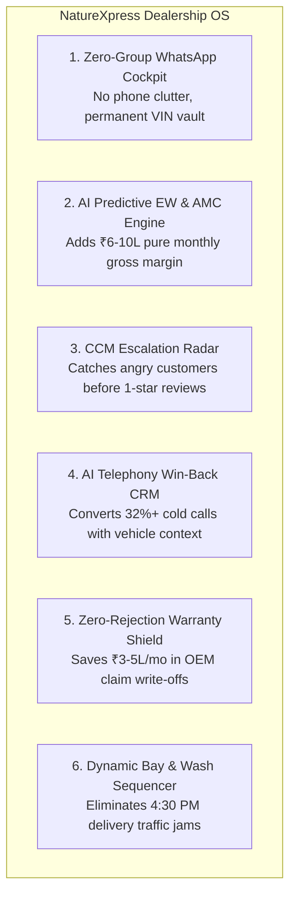
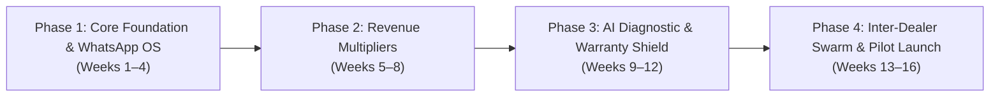

# NatureXpress Dealership Operating System: The Unified Master Enterprise Blueprint
**Company:** NatureXpress Technologies  
**Founder:** Chetan  
**Target Market:** Tata Motors Authorized Dealership Groups (Dealer Principals, Managing Directors, CEOs, General Managers & OEM Territory Leadership)  
**Classification:** Master Strategic Pitch, System Architecture, Engineering Specifications & Rollout Blueprint  

---

## 1. Executive Summary & The High-Ticket Value Proposition

### 1.1 The Core Dilemma: Why Dealerships Will Pay Lakhs for NatureXpress
Every Dealership Principal (Owner/MD) asks the same question:  
*"Tata Motors has already provided us with e-DMS (Siebel/SAP), TDS diagnostic software, and V-Connect. Why should we invest Lakhs in NatureXpress?"*

```
┌──────────────────────────────────────────────────────────────────────────────────┐
│                   THE CRUCIAL DISTINCTION THAT SELLS OUR SYSTEM                  │
├────────────────────────────────────────┬─────────────────────────────────────────┤
│     Tata Motors Official e-DMS         │     NatureXpress Dealership OS          │
├────────────────────────────────────────┼─────────────────────────────────────────┤
│ • A backward-looking "Tax & Invoicing" │ • A forward-looking "Profit & Velocity" │
│   record-keeping system for the OEM.   │   growth engine for the Dealership.     │
│ • Slow, rigid, causes morning crashes. │ • Real-time, offline-first on the floor.│
│ • Customer sees zero value in it.      │ • Delights customers via WhatsApp.      │
│ • Rejects warranty claims on errors.   │ • Auto-audits claims to guarantee payout│
│ • Captures zero lost customer revenue. │ • Recovers post-warranty lost clients.  │
└────────────────────────────────────────┴─────────────────────────────────────────┘
```

> **The Pitch to the Owner:**  
> *"Sir, e-DMS is for Tata Motors' corporate reporting. NatureXpress is for **your bank account**. NatureXpress sits on top of e-DMS as the Operational Supercharger that eliminates workshop bottlenecks, recovers lost warranty money, multiplies high-margin Extended Warranty sales, and puts ₹15+ Lakhs in net new gross profit directly into your dealership every month."*

---

## 2. Ground-Reality Audit & The 7-Stakeholder Matrix

To build a system that thrives on grease-stained workshop floors rather than just in pitch decks, NatureXpress addresses the daily operational realities of all 7 stakeholders:

```
                  ┌──────────────────────────────────────────────────┐
                  │             THE 7 STAKEHOLDER MATRIX             │
                  └─────────────────────────┬────────────────────────┘
                                            │
         ┌───────────────────┬──────────────┴───────┬───────────────────┐
         │                   │                      │                   │
┌────────▼────────┐ ┌────────▼────────┐    ┌────────▼────────┐ ┌────────▼────────┐
│    Customer     │ │ Service Advisor │    │   Technician    │ │  Floor Manager  │
│  Mistrust, Cost │ │ Burnout & Rush  │    │ Low Skill, FRT  │ │ Bay Bottlenecks │
└────────┬────────┘ └────────┬────────┘    └────────┬────────┘ └────────┬────────┘
         │                   │                      │                   │
         └───────────────────┼──────────────────────┼───────────────────┘
                             │                      │
                    ┌────────▼────────┐    ┌────────▼────────┐
                    │  Parts Manager  │    │ Dealership MD/GM│
                    │ Stockouts & Dead│    │ Cashflow, Margin│
                    └────────┬────────┘    └────────┬────────┘
                             │                      │
                    ┌────────▼──────────────────────▼────────┐
                    │      Tata Motors OEM (Territory TM)    │
                    │    Warranty Fraud, Brand Perception    │
                    └────────────────────────────────────────┘
```

| Stakeholder | Real-World Ground Friction | NatureXpress Solution |
| :--- | :--- | :--- |
| **1. Customer** | Opaque bills with forced add-ons; zero visibility during 8-hour workshop stay; unresolved repeat electrical/DCA glitches. | Real-time WhatsApp interactive tracking; 15-sec video-backed 1-tap approvals; guaranteed QA digital checklist. |
| **2. Service Advisor (SA)** | Overloaded with 15–22 cars/day (vs. optimal 7–8); slow e-DMS server lags at 9:30 AM; fear of salary penalties from 10/10 CSI score drops. | Fast voice-to-text job card intake; auto-priced quote builder; real-time commission ticker for Extended Warranty (EW) sales. |
| **3. Floor Technician** | Unpaid diagnostic time (FRT pays ₹0 for electrical fault hunting); low English literacy; complex modern BS6.2 & EV electronics. | Vernacular voice-guided diagnostic steps (Hindi/Hinglish); visual wiring schematics; BLE-connected OBD-II VCI scanner. |
| **4. Floor / Works Manager** | Morning intake rush (80% cars arrive between 9–11 AM); severe chokepoints at 4:30 PM washing bays; bay idle time waiting for parts. | Dynamic Bay & Wash Sequencer (CSP algorithm); automated technician-skill matching; express lube load balancer. |
| **5. Spare Parts Manager** | 7–12 days lead time from Pune/Sanand plant; ₹15–30 Lakhs trapped in dead stock; mechanics cannibalizing parts between cars. | Inter-Dealer Indore Virtual Parts Pool; RFID/barcode bin checkout linked to active Job Cards; automated dead-stock liquidation. |
| **6. Dealer Principal / MD** | High warranty rejection rates (8–12% loss); 62% post-warranty customer churn after Year 3; high technician turnover. | Real-time Gross Profit/Bay/Hour dashboard; AI Zero-Rejection Warranty Shield; "Indore Value Club" post-warranty retention engine. |
| **7. Tata OEM Territory Team** | Customer escalation leakage to social media (Twitter/Team-BHP); warranty fraud and incorrect diagnostic part swapping. | CCM Early-Warning Escalation Radar; mandatory freeze-frame DTC logs & verified photos before warranty approval. |

---

## 3. The 8 Tata Insider Ground-Truth Realities (Validated)

These 8 operational realities—directly confirmed by Tata Motors dealership employees—form the foundation of our engineering:

1. **e-DMS / Siebel Morning Lag:** Official DMS servers slow down during 9:30–11:30 AM intake, forcing paper scratchpads and missed customer complaints.
2. **Flat Rate Time (FRT) vs. Diagnostic Hell:** Mechanics get paid standard labor for physical part swaps, but ₹0 for hours spent diagnosing intermittent CAN-bus electrical gremlins.
3. **Absence of "Child Parts":** OEM often supplies only whole assemblies (e.g., ₹38,000 steering rack for a ₹300 bush), driving up customer costs and wait times.
4. **The 4:30 PM Washing Bay Bottleneck:** 40+ vehicles finish mechanical work on time but gridlock at 2 pressure washing bays, ruining on-time delivery.
5. **Pre-Delivery Road Test (RT) Bypassing:** Afternoon rush causes supervisors to sign off inspection sheets without the mandatory 5 km road test, resulting in immediate customer return.
6. **EV High-Voltage (HV) Hesitation:** General mechanics fear 350V+ DC electric shock, routing all Nexon/Punch/Tiago EV tickets to 1 or 2 certified mechanics, creating an EV bottleneck.
7. **Warranty Claim Rejections:** Dealers lose lakhs monthly when OEM rejects claims because freeze-frame diagnostic logs or photos were not captured *before* clearing DTCs.
8. **The WhatsApp 50-Group & Deletion Crisis:** Dealership staff create personal WhatsApp groups for each car, hitting group limits, running out of storage, and deleting chats after 1–2 days—destroying all legal and warranty audit trails.

---

## 4. The 6 Breakthrough "WOW" Factors of NatureXpress



### WOW 1: Zero-Group WhatsApp Unified Cockpit (Customer & SA Delight)
* **Zero Personal Groups:** Powered by the official **WhatsApp Cloud API** via a single verified dealership number.
* **Unified Multi-Agent Desk:** SA, Floor Manager, Quality Controller, and GM view and participate in the same live conversation thread on their tablet/web interface.
* **Permanent VIN Archival:** Every video clip, price quote, and customer approval is permanently archived in the cloud linked to the vehicle's **Chassis/VIN Number** for lifetime dispute and warranty protection.

### WOW 2: The Predictive Extended Warranty (EW) Revenue Machine
* **Predictive Milestone Trigger:** When a vehicle enters for its 3rd service or hits 25,000 km, the system computes future out-of-warranty exposure:
  > *"Your Harrier's Electronic Steering Rack & Infotainment replacement cost after warranty = ₹64,000. Extended Warranty coverage until Year 5 = only ₹14,200 (₹39/day or ₹1,183/mo No-Cost EMI)."*
* **1-Click Digital No-Cost EMI:** Instant checkout via Razorpay/Pine Labs integration.
* **SA Real-Time Gamification:** SA tablets display instant cash incentive alerts the moment an EW package is booked.

### WOW 3: The OEM CCM Early-Warning Escalation Radar
* **Auto-Escalation Triggers:** Flags vehicles parked > 36 hours for routine jobs, repeat visits within 14 days for the same symptom, or frustrated sentiment on WhatsApp.
* **Direct CCM Command Console:** Instantly delivers a complete vehicle history and root-cause dossier to the Tata OEM Customer Care Manager and Dealer GM.
* **Pre-Emptive Intervention:** Enables the CCM to call the customer with full context, offer courtesy cars, or provide goodwill discounts **before** a 1-star Google Review or Twitter escalation occurs.

### WOW 4: AI Smart Telephony CRM (CRE Win-Back Engine)
* **Dynamic Context Card:** When the dialer connects, the CRE screen displays:
  * Vehicle: *Nexon XZA+ Petrol* | Predicted Odometer: *31,400 km* (calculated from past usage cadence).
  * Pending Advisories from last visit: *"Front brake pads were at 30% wear 4 months ago; recommended replacement now."*
  * Personalized Hook: *"Monsoon Brake & Wiper Safety Camp - Complimentary 24-point check."*
* **Automated WhatsApp Pre-Nudge:** Warm lead invitation sent 2 hours before the call with a 1-tap slot selection button, boosting booking conversion from **8% to 32%+**.

### WOW 5: Zero-Rejection AI Warranty Shield
* **Pre-Audit Image Validation:** AI vision model verifies that photos of the VIN plate, odometer, and failed components meet OEM clarity and angle guidelines before disassembly.
* **ECU Freeze-Frame Enforcement:** Automatically captures and locks CAN-bus DTC snapshot data into the claim packet *before* allowing the technician to clear fault codes.

### WOW 6: Dynamic Bay & Washing Load Balancer (CSP Sequencer)
* **Constraint Satisfaction Algorithm:** Continuously calculates:
  $$\text{Objective} = \min \sum (\text{Vehicle Wait Time} + \text{Bay Idle Time}) + \alpha(\text{Washing Delay})$$
* Spreads washing and dry-cleaning slots across the workday, eliminating the 4:30 PM delivery bottleneck and boosting bay throughput by **40%+**.

---

## 5. Full-Stack Technical & Hardware Architecture

```
┌────────────────────────────────────────────────────────────────────────────────────────┐
│                                CLIENT / EDGE LAYER                                     │
├────────────────────────────┬────────────────────────────┬──────────────────────────────┤
│ Customer WhatsApp & WebApp │ SA / Floor Manager Tablet  │ Technician Rugged Terminal   │
│ (React + WebSockets)       │ (Flutter Cross-Platform)   │ (Offline-First PWA + VCI BLE)│
└─────────────┬──────────────┴─────────────┬──────────────┴──────────────┬───────────────┘
              │                            │                             │
              ▼                            ▼                             ▼
┌────────────────────────────────────────────────────────────────────────────────────────┐
│                           API GATEWAY & EDGE SYNC BROKER                               │
│                (Kong Gateway / Cloudflare Edge + RabbitMQ Message Bus)                 │
└──────────────────────────────────────────┬─────────────────────────────────────────────┘
                                           │
    ┌──────────────────────────────────────┼──────────────────────────────────────┐
    ▼                                      ▼                                      ▼
┌────────────────────────┐    ┌────────────────────────┐    ┌──────────────────────────┐
│  AI Diagnostic Engine  │    │ Dynamic Bay Optimizer  │    │  Indore Virtual Parts    │
│  - DTC Knowledge Graph │    │ - Genetic Load Balancer│    │  - Inter-Dealer Exchange │
│  - Acoustic Fault Rec  │    │ - Tech-Skill Matching  │    │  - Stockout Predictor    │
└───────────┬────────────┘    └───────────┬────────────┘    └────────────┬─────────────┘
            │                             │                              │
            └─────────────────────────────┼──────────────────────────────┘
                                          │
                                          ▼
┌────────────────────────────────────────────────────────────────────────────────────────┐
│                                CORE DATA & INTEGRATION                                 │
├────────────────────────────┬────────────────────────────┬──────────────────────────────┤
│ PostgreSQL (Primary ACID)  │ Redis (Bay Telemetry Cache)│ MinIO / S3 (Video Evidence)  │
├────────────────────────────┴────────────────────────────┴──────────────────────────────┤
│ Legacy Connectors: Tata Siebel / e-DMS REST & SOAP Adapter | OBD-II ISO-14229 / UDS   │
└────────────────────────────────────────────────────────────────────────────────────────┘
```

### 5.1 Hardware & Diagnostic Protocols
* **Diagnostic Hardware:** IP65 ruggedized Android tablets paired with Bluetooth 5.2 Low Energy (BLE) OBD-II VCI dongles.
* **Protocols:** ISO 14229 (UDS), ISO 15765 (CAN-bus), SAE J1939, and K-Line.
* **Offline-First Synchronization:** SQLite + WatermelonDB local database on technician tablets. If workshop basements lose connectivity, technicians continue guided diagnostics uninterrupted; data syncs automatically upon reconnection.
* **Acoustic Diagnostic AI:** On-device CNN audio model analyzes engine idling, belt squeals, or turbo spool to differentiate timing belt slack from alternator bearing wear.

---

## 6. Dealership Unit Economics & ROI Math (Pitch Deck Model)

Financial projections for a standard 30-bay Tata Motors authorized workshop:

```
┌────────────────────────────────────────────────────────────────────────────────────────┐
│              MONTHLY FINANCIAL IMPACT PER DEALERSHIP (30-BAY WORKSHOP)                 │
├────────────────────────────────────────────────────┬───────────────────────────────────┤
│ Revenue / Profit Driver                            │ Monthly Financial Gain (INR)      │
├────────────────────────────────────────────────────┼───────────────────────────────────┤
│ 1. Incremental EW & AMC Package Sales (40 addl.)   │ + ₹3,20,000  (Pure Profit Margin) │
│ 2. Eliminated OEM Warranty Claim Rejections        │ + ₹2,80,000  (Direct Loss Saved)  │
│ 3. 25% Increase in Bay Throughput (Labor Revenue)  │ + ₹4,50,000  (Additional Labor)   │
│ 4. CRE Win-Back of Lost Post-Warranty Customers    │ + ₹3,60,000  (Parts + Labor)      │
│ 5. Increased VAS Conversion via Video Approvals    │ + ₹1,90,000  (High Margin)        │
├────────────────────────────────────────────────────┼───────────────────────────────────┤
│ TOTAL GROSS PROFIT ADDITION PER MONTH              │ + ₹16,00,000 / Month              │
├────────────────────────────────────────────────────┼───────────────────────────────────┤
│ NatureXpress Enterprise SaaS Subscription Fee      │ - ₹1,50,000 / Month               │
├────────────────────────────────────────────────────┼───────────────────────────────────┤
│ NET DEALER PROFIT ROI MULTIPLIER                   │ > 10.6x Return On Investment      │
└────────────────────────────────────────────────────┴───────────────────────────────────┘
```

---

## 7. Phased 16-Week Engineering & Rollout Plan



* **Phase 1 (Weeks 1–4): Core Foundation & WhatsApp Thread OS**
  * PostgreSQL + Redis + S3 database and media vault.
  * WhatsApp Cloud API unified multi-agent web/tablet desk.
  * Customer interactive web card (Live Job Card, 15-second video approvals).
  * Digital SA Check-in tablet app with voice-to-text in Hindi/English.
* **Phase 2 (Weeks 5–8): High-Margin Revenue Engines**
  * Predictive Extended Warranty (EW) calculator with 1-click No-Cost EMI checkout.
  * AI Smart Telephony CRM for calling staff with dynamic vehicle context cards.
  * Gamified real-time incentive dashboard for SAs and CREs.
* **Phase 3 (Weeks 9–12): AI Diagnostic & Warranty Shield**
  * AI Warranty Pre-Audit Engine (image clarity validation + freeze-frame log lock).
  * Offline-first technician diagnostic guide with step-by-step failure trees.
  * Dynamic Bay & Washing Slot Sequencer algorithm.
* **Phase 4 (Weeks 13–16): Inter-Dealer Swarm, CCM Radar & Pilot Deployment**
  * CCM Early-Warning Escalation Radar with push alerts and Telegram/WhatsApp emergency dossiers.
  * Indore Virtual Parts Pool for intra-city inventory sharing and dead-stock liquidation.
  * 30-Day Paid Pilot deployment at flagship Indore dealership.

---

## 8. Pricing Structure & The "Zero-Risk" Pilot Guarantee

| Plan Tier | Pricing Structure | Target Scope |
| :--- | :--- | :--- |
| **1. Single Dealership Outlet** | ₹4.5 Lakhs Setup + ₹75,000/month | 1 Workshop (15–20 Bays) |
| **2. City Enterprise Cluster** | ₹12 Lakhs Setup + ₹1.8 Lakhs/month | All Outlets in 1 City (e.g., Indore) |
| **3. State/Multi-Dealer Network** | ₹25 Lakhs Setup + ₹3.5 Lakhs/month | Full Dealer Territory Group |

### The "Zero-Risk" Pilot Guarantee to Dealer Principals:
*"Deploy NatureXpress at your primary workshop for 30 days. If your Extended Warranty sales do not increase by at least 30% and your 4:30 PM delivery delays do not drop by at least 40%, you pay zero."*
